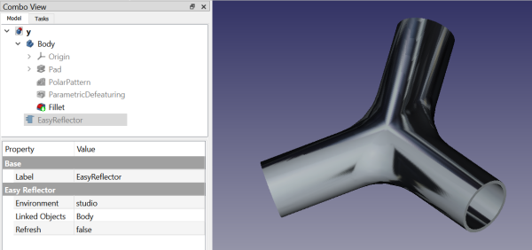

# EasyReflector
Easily manage textures in FreeCAD

## Toolbar Icon

## Credits
Based on this repo: https://github.com/Athanaze/Freecad-easy-reflections
I just made it into a feature python object that would be persistent between FreeCAD sessions and added the capability to specify custom texture files.

## Installation
Put the EasyReflector.FCMacro file into your macros folder.  It will create the easyreflector.py file for you and also it will download the image texture files and place them into your macros/easy_reflections folder.

## Usage

Select the object you wish to apply the texture to, and then run the EasyReflector.FCMacro macro.  (Do not run the easyreflector.py file as it is imported by the .FCMacro file and by FreeCAD when you load a document containing one of the EasyReflector objects.)

The studio texture is applied to the selected object(s) by default, but you can change that by editing the Environment property of the EasyReflector object.  You can also drag and drop objects onto the EasyReflector icon in the combo view to add them to the LinkedObjects property.

You can use your own image file for the texture instead of the files provided here.  To do this, choose the "other image file" option for the Environment.  This makes visible the "Image File" property, which you can use to select your image file to apply.  The file can reside in any directory.

You can also put your own image files into the easy_reflections folder and when you create a new EasyReflector object those files will appear in the Environment property as an option.  As of version 0.2023.09.04d more image file formats are supported in addition to JPG.

If you delete the EasyReflector objects, it will remove texturing from all of the LinkedObjects.

## Properties
Each EasyReflector object has properties with which it can be modified.
### Enabled (boolean)
Default:True.  Set to False if you want to temporarily remove texturing.  (Double-clicking on the icon in the tree will toggle this property, too.)
### Environment (Enumeration)
Default: studio.  Change this to "image file" if you want to provide your own custom image.  Change it to "none" if you don't want texturing.  (The none option actually uses white.jpg as the texture.)  If you add more JPG files to your easy_reflections folder (a subfolder of the macros folder) these options will be added to the Environment property the next time you create a new EasyReflector object.
### LinkedObjects (Property Link List)
These are the objects to which the textures will be applied.  You can populate this list in a number of ways: 1) by first selecting the objects to texture before creating the EasyReflector object; 2) by manually editing the LinkedObjects property; 3) by dragging/dropping objects on to the EasyReflector icon in the combo view.

Note: Removing a textured object from the LinkedObjects list does not automatically remove its current texture, if any.  To remove the textures you can edit the Enabled property to false or delete the EasyReflector object or by removing the object from the list, saving the file, and reloading it.
### Version (string)
version of the macro used to create this EasyReflector object

## ChangeLog
### 0.2023.09.20
Check for incompatible types in LinkObjects property
Warn if no object was selected during object creation
### 0.2023.09.05
Toolbar icon fixed when installing from addon manager (hopefully)
Tried to use XPM text the first time, but evidently the exact format was wrong, so
I switched to using __icon__ = url_to_toolbar_icon_file.svg
### 0.2023.09.04f
Attempt to fix issue with toolbar icon when installing from addon manager
### 0.2023.09.04e
Avoid some warning messages when creating message boxes during installation and file downloads.
### 0.2023.09.04d
Now can use any image file in the easy_reflections folder, not just .jpg files
Try to improve download speed using concurrent downloading
Display wait cursor during file download
### 0.2023.09.04b -- added view provider and icons
Now can accept drag and drop
Untextures its LinkedObjects upon deletion
Dynamic icon change upon enabling/disabling
Enable/Disable via double click
### 0.2023.09.04 -- now creates .py file automatically, and also downloads images and puts them in macros/easy_reflections folder
adds ability to put new .jpg files into the easy_reflections folder, the Environment property automatically updates for new EasyReflector objects
### 0.2023.09.03 -- initial uploaded version

